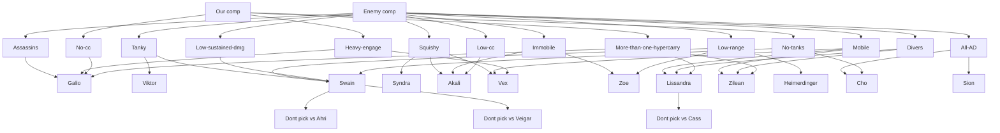

## What every comp needs

- Engage
- Disengage/peel
- Mix of AP/AD
- 1 or 2 frontliners

Nuance to it though

- For example if Fiora, we need something to match her on the side lanes
- If there are tanks, you need consistent DPS, rather than burst
- Think about power through game, e.g don't pick an all-scaling comp
- If they don't have engage, we can go poke

## My comfort picks

- Viktor
- Syndra
- Swain
- Akali
- Lissandra
- Aurelion Sol

### Aurelion Sol

#### Rune pages

Need to swap them around. Might want to take adaptive force over attack speed if not contesting.

##### Against free match, melee

- First strike
- Magical footwear
- Sorcery: Absolute focus, gathering storm

#### Against assasins

- Spellbook for defensive summoners
- Futures market to get catalyst earlier
- Go resolve second, bone plating vs all in, second wind vs poke
- Overgrowth
- Take attack speed here

#### Comet vs outranges, or vs non sustain (syndra, ori, zoe) - cant proc first strike

- Manaflow, transcendence, gathering storm
- Second wind vs poke, overgrowth

### Viktor

- Tear is legit now
- Go First Strike if chilling out, go aery, scorch to dominate lane (vs melee or easy)
- Not good at skirmishing early, if early fun anticipated, may not be best pick

### Syndra

- Generally good, can blow things up, can make game winning picks late
- A bit vulnerable to ganks, look at their jungle pick
- Quite decent vs mobile squishies due to point and click ult

### Swain

- Nice vs short range, offers frontline
- Really good vs low damage comps

### Orianna

- Controls lane well
- Good combo with other big Rs
- Remember to keep ball close against assasins
- Remember to weave AAs
- I still die too much

### Vex

- Kassadin counter

### Akali

- Immobile squishies gonna die

### Lissandra

- Similar to galio but offers more AP and reliable CC

### Galio

- Need carry jungler ideally
- Fantastic counterpick to assassins

## Champs i can play, but not pro at

practice these!

- Orianna - great when rest of team has wombo, nice against melee. Remember to keep ball close if against assassin
- Zoe - great vs melee and immobile. Remember to take out back waves first to open bubble opportunity. Punish cooldowns and all-in. Stand back in teamfights. **i am dying too much early**

### My pool needs

- A mixture of AD and AP
- Early/late strength
- Need a beefy counter to assasins, Galio/Sett

## After getting prio, these are the list of items

(todo) make a decision tree based off this vid https://www.youtube.com/watch?v=qD4Wv515IV0

## Basing

- Do I have gold to buy something? (1k is a good rule of thumb)
- If poor waveclear (e.g Akali), probably not worth shoving, as it'll more likely set up a freeze. So just match the base

## Things to think through start of game

- Think of the side of lane to lean
   - e.g If top is tank vs tank, not likely to be gank heavy, so ward to botside
- Am i likely to be ganked?
   - What jungler do they have?
   - If not, think about how to use priority
   

