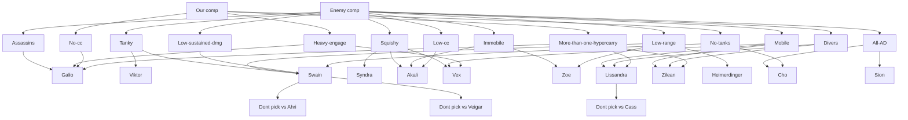

## What every comp needs

- Engage
- Disengage/peel
- Mix of AP/AD
- 1 or 2 frontliners

Nuance to it though

- For example if Fiora, we need something to match her on the side lanes
- If there are tanks, you need consistent DPS, rather than burst
- Think about power through game, e.g don't pick an all-scaling comp
- If they don't have engage, we can go poke

## Synergy with jungle

Need combination of CC and damage

## Specific counterpicks

- vs AD assasins = Malphite
- vs AP assasins = Galio
- vs melee heavy = Taliyah
- Blind pick = Ori or Viktor

### My pool needs

- A mixture of AD and AP
- Early/late strength
- Need a beefy counter to assasins, Galio/Sett

## Basing

- Do I have gold to buy something? (1k is a good rule of thumb)
- If poor waveclear (e.g Akali), probably not worth shoving, as it'll more likely set up a freeze. So just match the base

## Things to think through start of game

- Think of the side of lane to lean
   - e.g If top is tank vs tank, not likely to be gank heavy, so ward to botside
- Am i likely to be ganked?
   - What jungler do they have?
   - What about support?
   - Maybe go phase rush if ganks likely
   - If not, think about how to use priority
- Play safe 3-4 mins
- Don’t use CC/escape when pushed
- Run away from jungle, not necessarily turret
- Only pressure when you have numbers advantage
- Bait baron to use gold advantages

## First back thoughts

- lost chapter is greedy, take if enemy jungle is behind, if we're ahead etc
- otherwise, boots, dark seal

