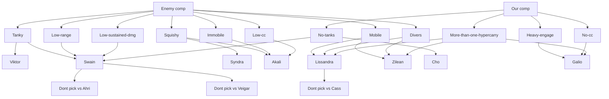

```mermaid


graph TD
    E[Enemy comp]
    E --> Tanky
    E --> Squishy
    E --> Immobile
    E --> Mobile
    E --> Divers
    E --> Low-range
    E --> Low-cc
    E --> Low-sustained-dmg

    Tanky --> Viktor
    Tanky --> Swain
    Squishy --> Syndra
    Squishy --> Akali
    Immobile --> Akali
    Low-cc --> Akali
    Mobile --> Lissandra
    Mobile --> Zilean
    Divers --> Zilean
    Divers --> Lissandra
    Low-range --> Swain
    Low-sustained-dmg -->Swain

    B[Our comp]
    B --> No-tanks
    B --> More-than-one-hypercarry
    B --> No-cc
    B --> Heavy-engage

    No-tanks --> Swain
    No-tanks --> Cho
 
    Heavy-engage-->Galio
    No-cc --> Galio
    More-than-one-hypercarry-->Galio
    
    More-than-one-hypercarry-->Zilean
    More-than-one-hypercarry-->Lissandra

    Lissandra --> DontCss["Dont pick vs Cass"]

    Swain --> DontAhri[Dont pick vs Ahri]
    Swain --> DontVeigar[Dont pick vs Veigar]
```
